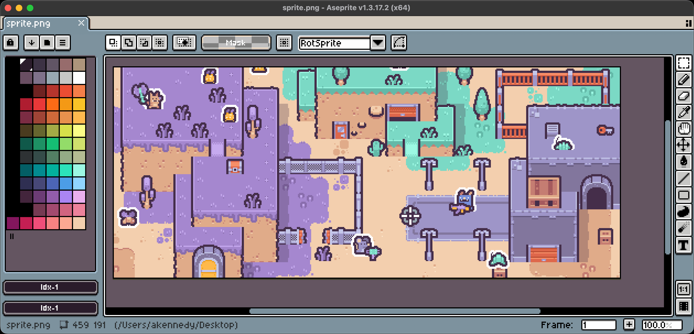
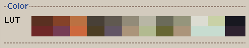
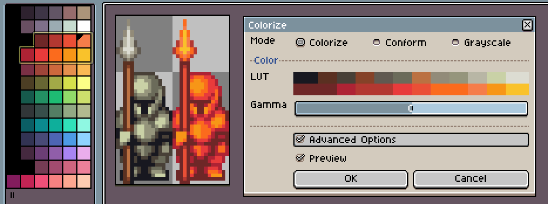
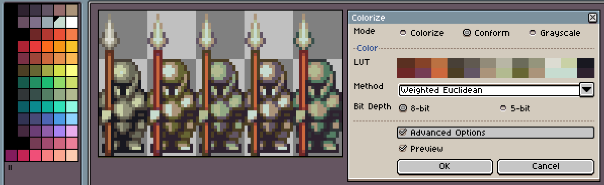
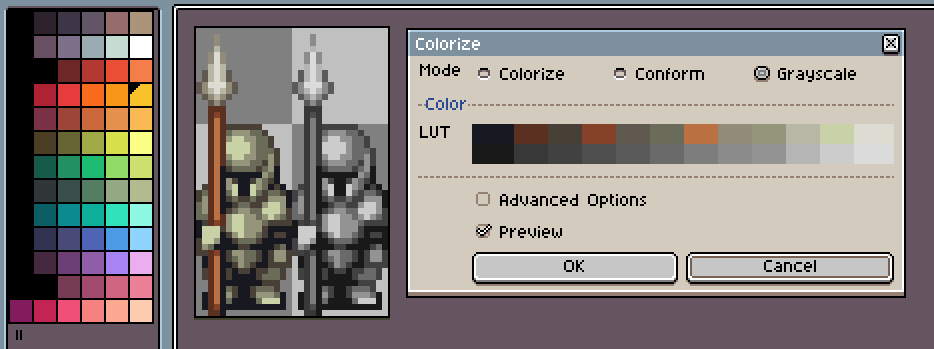
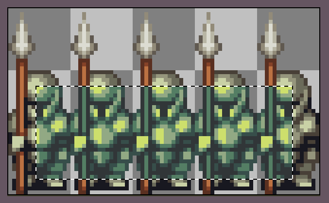
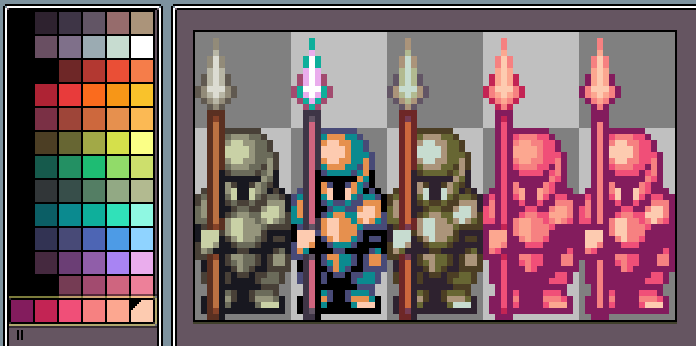

# aseprite-colorize
An Aseprite tool for quickly recoloring sprites.

## How does it work?
Colorize matches each color in your sprite with a color in your palette.

It then recolors your sprite, substituting each color from the sprite with its corresponding palette color.

_Top: Original sprite colors. Bottom: New palette colors._

These matching sets of colors are called a lookup table (LUT). The method used for generating the LUT depends on the mode and options.

## Colorize Mode

_Left: Original. Right: Colorized._

Recolor the sprite by replacing the sprite colors with a gradient of palette colors, ordered from darkest to lightest.

This works best when selecting multiple shades of the same hue from the palette.

**Options**
- Gamma: Shift the gamma of the gradient so that the midpoint colors skew lighter or darker.

## Conform Mode

_Left to right: Original, Weighted Euclidean, Euclidean, Redmean, Delta E._

Recolor the sprite by replacing the sprite colors with the closest matching colors in the palette.

There are several options to configure how the closest match is calculated.
Results can vary greatly depending on the colors in the sprite and the palette.

**Options**
- Method: The algorithm used to determine the closest matching color.
  - Weighted Euclidean: Colors are matched with more weight given to green, and less weight given to blue.
  - Euclidean: Colors are matched using the red, green, and blue components equally.
  - Redmean: Colors are matched with weight given to the red and blue components depending on the average amount of red in both colors.
  - Delta E: Colors are matched using the closest human-perceptible color.
- Bit Depth: The bit depth used when calculating the color.
  - 8-bit: Color distance is calculated with full 8-bit colors.
  - 5-bit: Color distance is calculated with reduced 5-bit colors. This is the bit depth used natively when Aseprite converts from RGB to Indexed color mode.

## Grayscale Mode

_Left: Original. Right: Grayscale._

Recolor the sprite by replacing the sprite colors with grayscale values.

## Selection
You can colorize multiple cels at once by selecting them in the Timeline.

If you have a selection in the Canvas, only the selected pixels will be colorized.

If you have a selection of colors in the Palette, only the selected colors will be used to create the LUT.

_Left to right: Original, Colorize mode with entire palette, Conform mode with entire palette, Colorize mode with pink hues selected, Conform mode with pink hues selected._

## Other
The sprites used in this documentation are from the following asset packs:
- https://kenney.nl/assets/desert-shooter-pack
- https://seliel-the-shaper.itch.io/cozy-furnishings
